<div align="center">
  
# 👋 Hello World! I'm Lia

### 🇧🇷 Brazilian Developer | Passionate about Creativity & Tech

[](https://discord.gg/KaruLabs)
[](https://github.com/Lyliun)


</div>

---

## 🌟 About Me

```javascript
const lia = {
    location: "Brazil 🇧🇷",
    role: "Fullstack Developer",
    journey: "Coding since 2022",
    passions: [
        "🎨 Shaders & Visual Effects",
        "🤖 Interactive Bots & Automation",
        "🧠 Machine Learning",
        "🥽 VR/AR Experiences",
        "✨ Fullstack Developing"
    ],
    motto: "Turning ideas into real projects ✨"
};
```

<div align="center">

### 💡 What Drives Me

**Creating** • **Learning** • **Sharing** • **Growing**

*I believe in the driving power of technology to transform lifes and lead us to a bright future*

</div>

---

## 🛠️ Tech Arsenal

<div align="center">

### Core Languages


### Frameworks & Tools


### Specialties
`React.Js` • `Java` • `TailwindCss` • `Python` • `Node.Js`

</div>

---

## 🎨 Featured Projects

<table>
<tr>
<td width="50%">

### 🌈 [Lia's Shader](https://github.com/Lyliun/Lia-s-Shader)
Custom shader project for VR/3D environments

**✨ Highlights:**
- Real-time visual effects
- Optimized for VR performance
- Creative shader techniques

</td>

<td width="50%">

### 🔔 [Simplify Project](https://github.com/Lyliun/projeto-simplify)
Custom to-do list for daily tasks

**✨ Highlights:**
- Quickly add daily tasks
- Task Priority System(Low, Medium, High)
- Change between task states(Done/Pending)

</td>

<td width="50%">

### 🚀 More Coming Soon...
I'm constantly working on new projects!

**🔭 Areas I'm exploring:**
- Prompt Engineering
- Javascript
- Mathmatics

</td>
</tr>
</table>

---

## 📊 GitHub Analytics

<div align="center">
  
  
</div>

---

## 🎯 Current Focus

```mermaid
graph LR
    A[📘 TypeScript] --> B[⚛️ React.js]
    C[💻 C#] --> D[🎨 ShaderLab]
    E[📦 Open Source] --> F[🌍 Networking]
    B --> G[🚀 Innovation]
    D --> G
    F --> G

```



<div align="center">

## 💬 Let's Connect!

<div align="center">

**I'm always open to interesting conversations and collaborations!**

[](https://discord.gg/KaruLabs)
[](https://github.com/Lyliun)

</div>

---

<div align="center">

### ⚡ Fun Fact

*"Good ideas do not sprout on their own. We have to nurture them well."*

**Thanks for Visiting! 💜**


</div>
